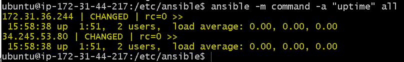
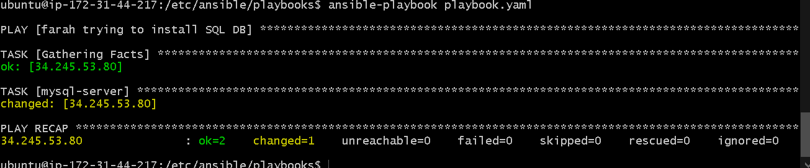

# IAC Ansible

Ansible is a IAC Configuration management tool.

We are setting up our controller machine in aws. Ansible_bash.sh is a script that will install ansible & accossiated dependencies.

## Host file

## Main Sections

## Main commands 
__pinging a host__
```bash

ansible all -m ping
```

__running commands on both machines__
```bash
ansible all -a "uname -a"
ansible all -a "date"
```

# Tasks:

```bash 
#this also works
ansible all -a uptime --become
```


__ansible commands for updating packages__

```bash
ansible host_a -m apt -a "upgrade=yes update_cache=yes" --become
```

```ansible
name: Update apt-get repo and cache
apt: update_cache=yes force_apt_get=yes cache_valid_time=3600
```

`--become` is essentially `sudo`but more flexible




## Writing a Playbook 
This section will cover:   
- Main structure
    - how to start a playbook
    - how to define where it runs (in the file)
    - how to make tasks 
- Writing a task / how to provision
    - syntax for installing a package!!
    ```YAML
    tasks:
      - name: what your function does
      # or npm etc, basically your package manager
      apt: 
        name: 
          - nginx
          - package2
        state: present
    ```

    - installing NPM packages
    ```YAML
    tasks:
      - name: install something using npm
        npm: 
    ```
    - how to create a file 

    ```YAML
    # delete a file
    - name: remove nginx default file from sites enabled
        file:
          path: /etc/nginx/sites-enabled/default
          state: absent


    - name: remove nginx conf file from sites available
        file:
          path: /etc/nginx/sites-available/default
          state: absent

    #
    - name: create nginx file in sites available
      file:
        path: /etc/nginx/sites-available/default.conf
        state: touch
        mode: 666
    
    - name: writing the nginx config file
      blockinfile:
        path: /etc/nginx/sites-available/default.conf
        bock: |
          server {
              listen 80;
              server_name 192.168.10.100;

              location / {
                  proxy_pass http://192.168.10.100:3000/;
              }
          }
        notify: 
    ```
    - how to create a symbolic link
    ```YAML
    - name: create a synbolic link between sites enabled and available
      file: 
        src: /etc/nginx/sites-available/default.conf
        dest: /etc/nginx/sites-enabled/
    ```

    - how to copy in folders (for lots of code)
        - scp way vs something that might be online
    - how to copy in folders
    - how to run shell commands (bash)

__Handlers__
    we need to manage services systemctl restart nginx for example
    - the modulee service
    - handlers notification system

```YAML
- name: start nginx
  service:
    name: nginx
    state: started
    enabled: yes

- name: restart nginx
  service:
    name: nginx
    state: restarted

- name: i am great!
  file:
    path: ~/great_farah_file.txt
    become_user: ubuntu
    state: touch 
```

__Handlers__
Handler notes v2 (trying to understand and prevent why its breaking my file)

